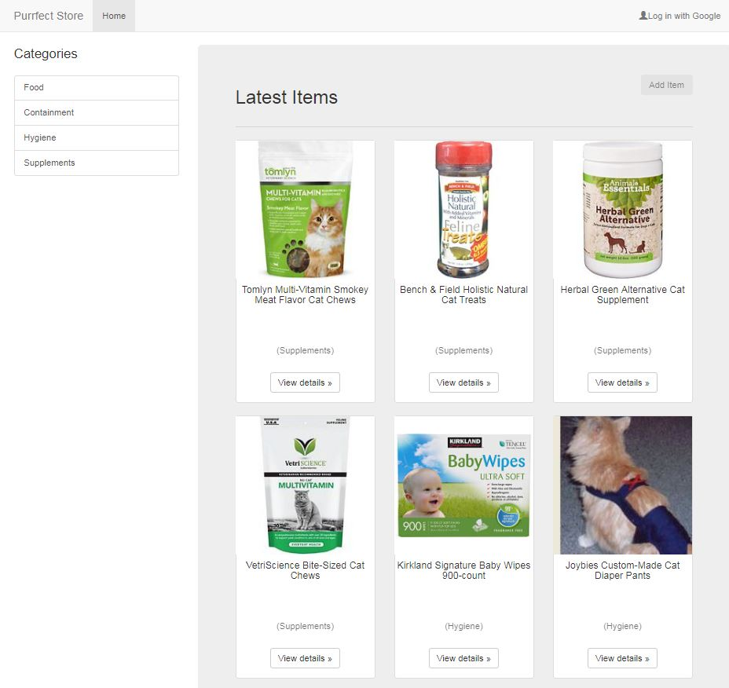

# Project Description

A full stack web application for a geriatric cat care store item catalog
1. Utilizing Flask framework with Python
2. Backend utilizes Sqlachemy with Sqlite (can also be converted to use Postgres)
3. Authentication uses latest Flask OAuth library (as of Dec 2017) with Google SignIn
4. CRUD and responsive design



## Getting Started

These instructions will get you a copy of the project up and running on your local machine for development and testing purposes.

### Prerequisites

1. Python installed (Python 2.7 and later)
2. VirtualBox and Vagrant installed (the version of these two software depends on your machine. I installed VirtualBox 5.1.30 and Vagrant 1.9.5)
3. Git bash or other command line tool installed
4. An Gmail account, and Google OAuth 2.0 CLIENT_ID and CLIENT_SECRET obtained.
5. The newest Flask-OAuthlib installed (as of Dec 2017)

### Instructions for obtaining Google OAuth CLIENT_ID and CLIENT_SECRET

1. Go to [developers.google.com](https://console.developers.google.com/) to set up a project
2. Go to Credentials, and select "OAuth Client ID" from the dropdown list, then select "Web application" (Please note that Google may change its developer console layout).
3. Very Important: In "Authorized JavaScript origins", enter "http://localhost". In "Authorized redirect URLs", enter "http://localhost/login/authorized".
4. After CLIENT_ID and CLIENT_SECRET created, save them.

### Installing the application

1. Download or clone this VM onto your local machine: [VM for Log Analysis Project](http://github.com/udacity/fullstack-nanodegree-vm)
2. Download the catalog repository onto your local machine, place it under the VM folder /vagrant

## How to run the application

1. Open views.py file from the catalog repository you downloaded, replace app.config['GOOGLE_ID'] and app.config['GOOGLE_SECRET'] with the credentials you obtained.
2. Start your Git Bash command tool.
3. cd into vagrant folder on your local machine, where you placed your VM image. Such as

```
$ cd C:\MY_VM\vagrant
```

4. At command prompt, type vagrant up

```
$ vagrant up
```

This may take a long time to run for the first time. Be patient.

5. Once Git Bash is at the command prompt again, type vagrant ssh

```
$ vagrant up
```
This will let your log into your VM.

6. Install Flask-Oauthlib

```
$ pip install Flask-OAuthlib
$ pip install --user flask-oauthlib
```

7. Go to the relevant catalog directory.

```
$ cd /vagrant
$ cd /catalog
```

8. At the command prompt, run

```
$ python database_setup.py
$ python database_init.py
```

This will setup the initial database. You only need to run it for the first time.

9. Start up the web server

```
$ python views.py
```

10. Start up a browser, and type http://localhost:5000 to see the app running.


## Authors

* **Ying Xie**

## License

None

## Acknowledgements

* https://github.com/lepture/flask-oauthlib
* https://unsplash.com/search/photos/cat

